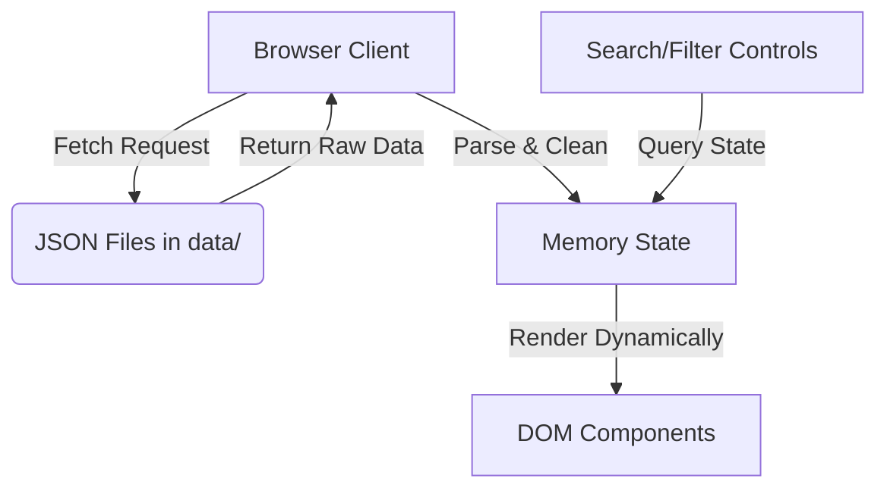

# Site Architecture: Salguero Lab Website

This document describes the information architecture, sitemap, page requirements, navigation flows, and database interactions for the website.

---

## 1. Sitemap
The website will feature a multi-page structure with clean, intuitive navigation:

```text
Home Page (/)
├── Research (/research)
│   └── Individual Project Detail Modals / Views
├── Team (/team)
│   ├── Faculty / PI Biography
│   ├── Current Students (Graduate & Undergraduate)
│   └── Alumni Directory
├── Publications (/publications)
│   └── Categorized bibliography with search/filter features
├── News & Gallery (/news)
│   ├── Chronological news items
│   └── Visual photo gallery of lab life
└── Contact (/contact)
    └── Inquiry form, office location map, and contact details
```

---

## 2. Page Definitions & Component Mapping
Below are the detailed descriptions and required dynamic components for each page:

### Home Page
- **Hero Section:** Large high-quality background graphic, group mission statement, and call-to-action buttons (e.g., "Join Our Lab", "Read Our Research").
- **Featured News & Highlights:** Carousel or grid of the 3 most recent news items or breakthroughs.
- **Quick Links:** Fast access to Research, Team, and Contact info.

### Research Page
- **Introduction:** Short summary of the group's research philosophy.
- **Projects Grid:** Dynamically generated from `projects.json`. Displays project cards with titles, short summaries, tags, and "Learn More" buttons (which open details in modal overlays).

### Team Page
- **PI Section:** Highlighted profile for Dr. Tina Salguero containing her photo, contact details, short bio, and education.
- **Students Grid:** Dynamically generated from `students.json`, split into Graduate and Undergraduate sub-sections.
- **Alumni Section:** Simple table or list generated from `alumni.json` showing graduation year and current position.

### Publications Page
- **Search & Filter Bar:** Input field for text search and dropdowns for sorting by publication year and tags.
- **Publications List:** Dynamically generated from `publications.json` using reverse-chronological order. Each citation includes author list, journal title, year, volume/pages, DOI links, and abstract expander.

### News & Gallery Page
- **News List:** Chronological feed from `news.json` showing titles, dates, excerpts, and images.
- **Photo Gallery:** Grid from `gallery.json` displaying captioned photos of lab setups, group outings, and presentations.

### Contact Page
- **Information Panel:** Address, email, phone number, and social media/Google Scholar links.
- **Interactive Map:** Embedding a Google Maps location of the UGA Chemistry Department.
- **Join Us Form:** Form for prospective students/postdocs to send inquiries.

---

## 3. Data Integration & State Management
The website relies on client-side JS to fetch and render raw data from JSON files located in the `data/` directory.



### JSON Data Feeds:
1. `faculty.json` &rarr; Injected into Home & Team PI sections.
2. `students.json` &rarr; Injected into Team Students section.
3. `alumni.json` &rarr; Injected into Team Alumni section.
4. `projects.json` &rarr; Injected into Research page cards.
5. `publications.json` &rarr; Injected into Publications page list.
6. `grants.json` &rarr; Injected into Research page funding section.
7. `news.json` &rarr; Injected into Home & News feed.
8. `gallery.json` &rarr; Injected into Gallery grid.
