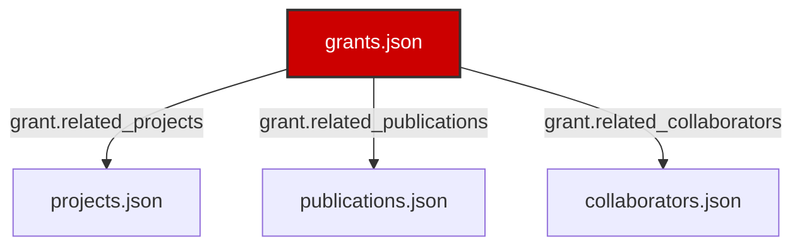

# Funding Page UI Redesign & Relational Architecture Spec

This document outlines the visual redesign, schema extensions, dynamic database relationship models, and future implementation hooks developed for the flagship Funding & Grants page of the Salguero Research Group website.

---

## 1. Unified Relational Architecture

The redesigned Funding portal is structured dynamically to fetch, filter, and cross-link data across five database files, linking grants to actual research output without duplicating text:
- **`grants.json` (Source Node):** Contains funding parameters, summaries, impacts, milestones, and cross-reference keys to other databases.
- **`projects.json` (Target Node):** Resolved via `grant.related_projects`. Renders project card highlights linked directly to scientific investigations.
- **`publications.json` (Target Node):** Resolved via `grant.related_publications`. Formats peer-reviewed citations enabled by the grant.
- **`collaborators.json` (Target Node):** Resolved via `grant.related_collaborators`. Displays external scientists whose work was co-supported by the award.

---

## 2. Visual Layout & UI Decisions

- **Metrics Dashboard:** Injects a dynamic overview statistics panel at the top of the page showing total grants, active/completed counts, unique sponsors, and counts of funded projects and publications.
- **Grant Cards:** Stretches into clean card grids. Bolds active status with primary Bulldog Red border highlights, and completed status with silver borders. The card header shows the title, and the body includes project summaries and gold-bordered scientific impact boxes.
- **Collapsible Relation Triggers:** Expandable accordions ("Explore Linked Projects & Publications") hide extensive relational listings, preserving readability.
- **Milestones Timeline:** Integrates the chronological milestones timeline showing the laboratory's funding progression by year.
- **Sponsorship Impact Grid:** Highlight cards demonstrating discoveries enabled, student training outcomes, collaborations, and societal relevance.

---

## 3. Extended Data Model

The JSON schema `grants.schema.json` was updated to incorporate the following new fields for each grant:
1. `award_year` (string): Chronological sorting key.
2. `summary` (string): Detailed overview.
3. `scientific_impact` (string): Narrative of enabled breakthroughs.
4. `techniques` (array of strings): Experimental methodologies funded.
5. `applications` (array of strings): Practical applications.
6. `related_projects` (array of strings): Linked project IDs.
7. `related_publications` (array of strings): Linked publication IDs.
8. `related_collaborators` (array of strings): Linked collaborator IDs.
9. `milestones` (array of strings): Chronological achievements.
10. `research_theme` (string): Category grouping badge.
11. `logo_url` (string): Path to sponsor logo.

---

## 4. Future Extension Points

The page layout contains stubs and placeholders to support future expansions:
- **Award Amount Details:** Extensible hooks inside the footer elements.
- **Annual Reports:** Citation triggers (`export-bibtex-stub` styled class) to download annual project report PDFs.
- **Official Award Pages:** Direct links to NSF/DOE project abstracts.
