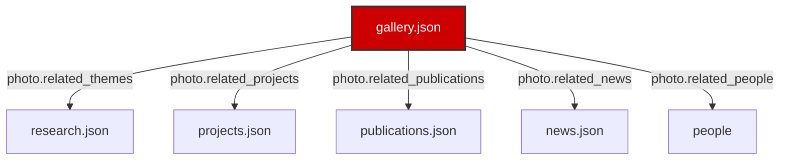

# Gallery Page UI Redesign & Relational Spec

This document details the visual redesign, schema extensions, dynamic database relationship models, and future implementation hooks developed for the flagship Lab Gallery page of the Salguero Research Group website.

---

## 1. Unified Relational Architecture

The redesigned Lab Gallery portal is structured dynamically to fetch, filter, and cross-link data across five database files, linking gallery images directly to the group's research outputs, publications, news, and people:
- **`gallery.json` (Source Node):** Contains photo parameters, URLs, titles, captions, categories, year, photographer credits, and cross-reference keys to other databases.
- **`research.json` (Target Node):** Resolved via `photo.related_themes`. Displays links to primary research themes.
- **`projects.json` (Target Node):** Resolved via `photo.related_projects`. Displays links to active or completed projects.
- **`publications.json` (Target Node):** Resolved via `photo.related_publications`. Displays links to peer-reviewed publications.
- **`news.json` (Target Node):** Resolved via `photo.related_news`. Links to lab updates or announcements.
- **`people` (Target Node):** Combines active students and graduated alumni into a single lookup index. Resolved via `photo.related_people` to link individual members.

---

## 2. Visual Layout & UI Decisions

- **Metrics Dashboard:** Injects a dynamic overview statistics panel at the top of the page showing total gallery images, categories represented, research/microscopy photos, outreach photos, conferences, and awards.
- **Featured Section:** Highlighted images (`featured: true`) are pinned to a dedicated top section when no filters are active, styled with an elegant gold border and category badges.
- **Gallery Grid:** Stretches into clean masonry cards. Renders thumbnails, titles, captions, photographer credits, and an expand button.
- **Professional Lightbox Viewer:** Displays a modal overlays with:
  - Previous / Next navigation buttons.
  - Keyboard navigation (Escape key to exit, left/right arrow keys to navigate).
  - High-contrast captions and meta attributes.
  - Interactive Zoom support on click (`transform: scale(1.5)` zoom effect).
  - Dynamic display of scientific mappings to other entities (themes, projects, publications, news, people).

---

## 3. Extended Data Model

The JSON schema `gallery.schema.json` was updated to incorporate the following new fields for each image:
1. `title` (string): Name of the photo.
2. `photographer` (string): Optional credit.
3. `category` (string, enum): Groups by Laboratory, Research, Microscopy, Crystal Growth, Instrumentation, Conferences, Outreach, Awards, Group Photos, or Teaching.
4. `featured` (boolean): Flag to pin highlights.
5. `year` (string): Chronological sorting.
6. `related_themes` (array of strings): Linked theme IDs.
7. `related_projects` (array of strings): Linked project IDs.
8. `related_publications` (array of strings): Linked publication IDs.
9. `related_news` (array of strings): Linked news IDs.
10. `related_people` (array of strings): Linked member IDs.

---

## 4. Future Ready Stubs

Prepared hooks and stubs inside the Lightbox and footer elements for:
- **Videos:** Hooks to support video files.
- **360° Lab Tours:** Hooks to embed virtual tour frames.
- **Before/After Comparisons:** Slider stubs.
- **Image Downloads:** Interactive button triggers.
- **Social Sharing:** Action hooks.
