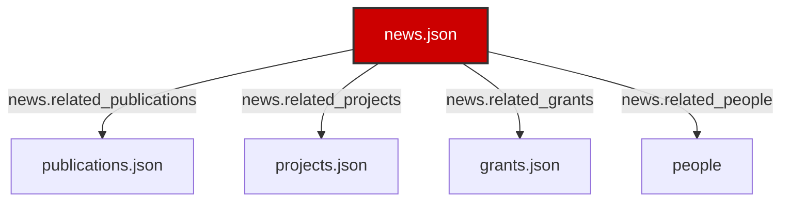

# News & Events Page UI Redesign & Relational Architecture Spec

This document details the visual redesign, schema extensions, dynamic database relationship models, and future implementation hooks developed for the flagship News & Events page of the Salguero Research Group website.

---

## 1. Unified Relational Architecture

The redesigned News & Events portal is structured dynamically to fetch, filter, and cross-link data across multiple database files, linking news announcements directly to the group's research outputs, grants, and people:
- **`news.json` (Source Node):** Contains news parameters, dates, titles, summaries, excerpts, categories, keywords, and cross-reference keys to other databases.
- **`publications.json` (Target Node):** Resolved via `news.related_publications`. Renders full citation metadata enabled or announced by the post.
- **`projects.json` (Target Node):** Resolved via `news.related_projects`. Renders project card highlights linked directly to the announcement.
- **`grants.json` (Target Node):** Resolved via `news.related_grants`. Links the news post to active or completed funding grants.
- **`people` (Target Node):** Combines active students from `students.json` and graduated alumni from `alumni.json` into a single lookup index. Resolved via `news.related_people` to link individual members.

---

## 2. Visual Layout & UI Decisions

- **Metrics Dashboard:** Injects a dynamic overview statistics panel at the top of the page showing total news updates, published papers, student awards, outreach events, and new members.
- **Featured Section:** Highlighted news articles (`featured: true`) are pinned to a dedicated top section when no filters are active, styled with an elegant gold border and visual tags.
- **News Cards:** Stretches into modern rows. Renders thumbnail placeholder slots (expandable in the future), category badges, and publishing dates. Bolds the titles and excerpts.
- **Collapsible Read More Drawers:** Expanded articles show detailed html descriptions alongside linked publications, projects, grants, and people.
- **Milestones Timeline:** Integrates the chronological laboratory timeline displaying all news milestones.

---

## 3. Extended Data Model

The JSON schema `news.schema.json` was updated to incorporate the following new fields for each news item:
1. `category` (string, enum): Groups by Publications, Awards, Conferences, Outreach, Student News, Lab Milestones, Funding, New Members, or Alumni.
2. `featured` (boolean): Flag to pin highlights.
3. `keywords` (array of strings): Indexing search terms.
4. `year` (string): Chronological filtering year.
5. `related_publications` (array of strings): Linked publication IDs.
6. `related_projects` (array of strings): Linked project IDs.
7. `related_themes` (array of strings): Linked research themes.
8. `related_grants` (array of strings): Linked grant IDs.
9. `related_people` (array of strings): Linked member IDs.

---

## 4. Future Ready Stubs

Prepared hooks and stubs inside the footer elements for:
- **Press Kits:** Action hooks for media kit PDF downloads.
- **Embedded Videos:** Action hooks for video modal dialogs.
- **Social Sharing:** Sharing options.
