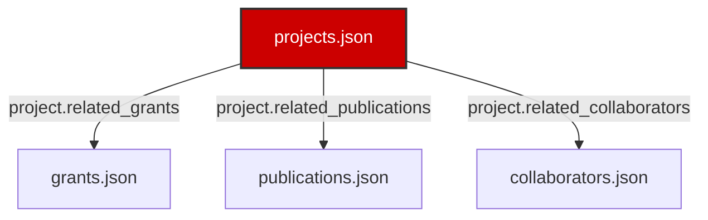

# Projects Page UI Redesign & Relational Architecture Spec

This document details the visual redesign, schema extensions, dynamic database relationship models, and future implementation hooks developed for the flagship Technical Projects page of the Salguero Research Group website.

---

## 1. Unified Relational Architecture

The redesigned Technical Projects portal is structured dynamically to fetch, filter, and cross-link data across five database files, linking projects to actual research output without duplicating text:
- **`projects.json` (Source Node):** Contains project parameters, motivations, leads, objectives, experimental techniques, expected outcomes, milestones, workflows, and cross-reference keys to other databases.
- **`grants.json` (Target Node):** Resolved via `project.related_grants`. Renders funding agencies, award numbers, and amounts funding the investigation.
- **`publications.json` (Target Node):** Resolved via `project.related_publications`. Formats peer-reviewed citations enabled by the project.
- **`collaborators.json` (Target Node):** Resolved via `project.related_collaborators`. Displays external scientists collaborating on the project.

---

## 2. Visual Layout & UI Decisions

- **Metrics Dashboard:** Injects a dynamic overview statistics panel at the top of the page showing total projects, active/completed portfolios, unique sponsors, and counts of funded publications and institutions.
- **Project Cards:** Stretches into clean card grids. Bolds active status with primary Bulldog Red border highlights, and completed status with silver borders. The card header shows the title, and the body includes project summaries and gold-bordered scientific motivation boxes.
- **Collapsible Relation Triggers:** Expandable accordions ("Explore Scientific Workflow & Relations") hide extensive relational listings, preserving readability.
- **Scientific Workflow Chart:** Visually communicates the path:
  `Scientific Question` → `Materials` → `Methods` → `Characterization` → `Results` → `Applications`.
- **Milestones Timeline:** Integrates the chronological milestones timeline showing achievements across all lab projects.

---

## 3. Extended Data Model

The JSON schema `projects.schema.json` was updated to incorporate the following new fields for each project:
1. `research_theme` (string): Theme grouping badge.
2. `scientific_motivation` (string): Motivation driving the project.
3. `research_objectives` (array of strings): Project goals.
4. `techniques` (array of strings): Experimental methodologies used.
5. `expected_outcomes` (string): Narrative of expected results.
6. `applications` (array of strings): Expected applications.
7. `timeline` (string): Duration dates.
8. `project_leads` (array of strings): Lab members leading the project.
9. `related_grants` (array of strings): Linked grant IDs.
10. `related_publications` (array of strings): Linked publication IDs.
11. `related_collaborators` (array of strings): Linked collaborator IDs.
12. `milestones` (array of objects with `year` and `title` keys): Achieved progress milestones.
13. `workflow` (object with `question`, `methods`, `materials`, `characterization`, `results`, `applications` keys): The steps of the scientific investigation.

---

## 4. Future Extension Points

The page layout contains stubs and placeholders to support future expansions:
- **Datasets:** Deep links to raw datasets.
- **GitHub Code:** Pointers to active software or instrumentation scripts.
- **Supplementary Info:** Direct links to SI files.
