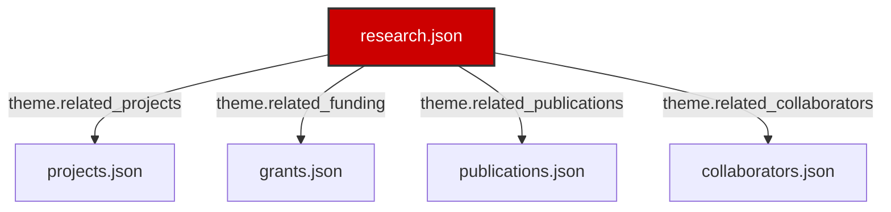

# Research Page UI Redesign & Relational Architecture Spec

This document describes the relational data architecture, component integrations, UI layout selections, and extendability options engineered for the flagship Research page of the Salguero Research Group website.

---

## 1. Unified Relational Architecture

To eliminate content duplication and enforce structured consistency, the Research page resolves relational associations across five independent JSON databases:
- **`research.json` (Source Node):** Contains primary themes, experimental techniques, potential applications, and cross-reference keys to other databases.
- **`projects.json` (Target Node):** Dynamically referenced by `theme.related_projects`. The system searches for matching project specs and displays the title, summary, and a deep-link button.
- **`grants.json` (Target Node):** Dynamically referenced by `theme.related_funding`. The system draws sponsor agencies, award numbers, and amounts to demonstrate funding viability.
- **`publications.json` (Target Node):** Dynamically referenced by `theme.related_publications`. The system formats related citations on-the-fly, bolding Tina Salguero's name.
- **`collaborators.json` (Target Node):** Dynamically referenced by `theme.related_collaborators`. Displays name, institution, and scientific focus.

---

## 2. Visual Layout & UI Decisions

- **Research Cards:** Themes are rendered in prominent grid blocks with left-side image slots and right-side content grids. The header contains a clear title, and the footer shows metadata counters (number of techniques, projects, and publications).
- **Expandable Accordion Panels:** Detailed panels are kept hidden by default. Clicking "Explore Theme Details" opens a split column view dividing structural content (Matters, Challenges, Projects, Publications) on the left, from experimental metadata (Techniques, Applications, Funding, Collaborators) on the right.
- **Research Impact Section:** An highlights grid grouping the group's research output into four pillars: Scientific Discoveries, Societal Impact, Industrial Relevance, and Future Directions.
- **Milestones Timeline:** Utilizes the group's milestone timeline system to highlight historic research leaps from 2013 (Egyptian Blue) to 2025 (In Situ heating STEM).

---

## 3. Accessibility & Performance

- **ARIA Semantics:** Proper heading hierarchies and label tags are implemented across the interactive toggle buttons.
- **Responsive Flexbox & Media Queries:** Collapses from a 2-column layout to vertical card views on tablets and mobile screens.
- **Low DOM Weight:** Details are injected into the DOM as hidden markup on load, avoiding extra layout reflows during toggling operations.
